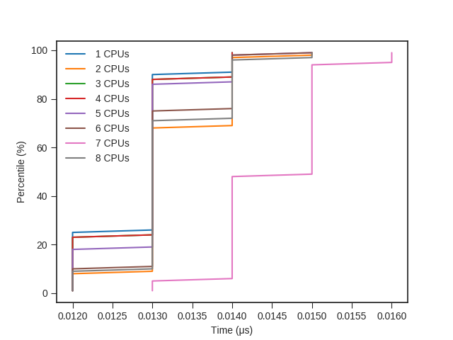
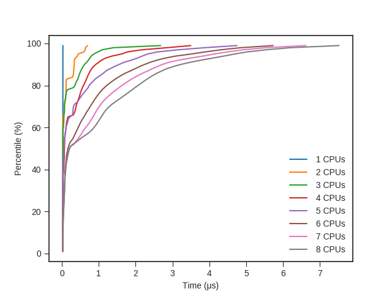
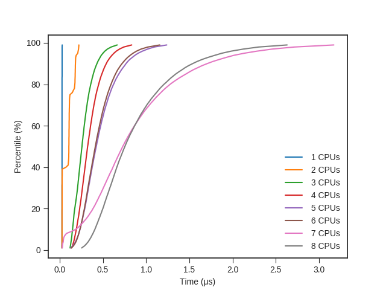
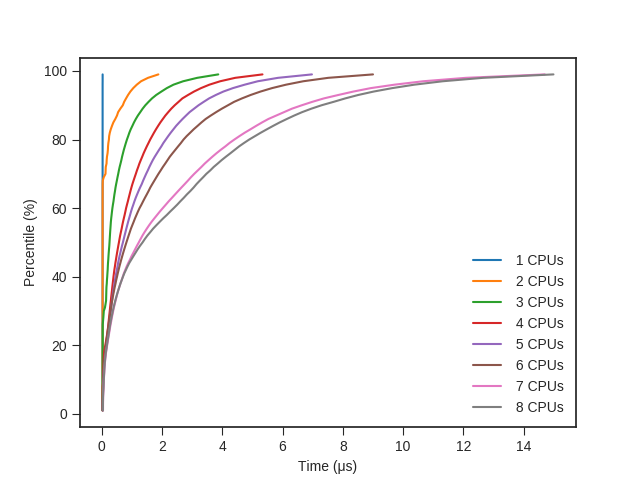

## POSIX Benchmark Results

**Hardware:**

```
Intel(R) Core(TM) i7-8565U CPU @ 1.80GHz
```

**Software:**

```
Linux xps 5.0.0-29-generic #31-Ubuntu SMP Thu Sep 12 13:05:32 UTC 2019 x86_64 x86_64 x86_64 GNU/Linux
```

### No operation 

The time to do nothing. This benchmark shows the baseline measurement overhead.



[[Benchmark](https://github.com/penberg/posixbench/blob/master//bench-pthread-nop.c)] [[CSV](bench-pthread-nop.csv)]

### Yield the processor

The time it takes for a thread to run again after yielding the processor with `pthread_yield`.


[[Benchmark](https://github.com/penberg/posixbench/blob/master//bench-pthread-yield.c)] [[CSV](bench-pthread-yield.csv)]

### Acquire and release a mutex

The time it takes for a thread to acquire and release a mutex that is under contention.



[[Benchmark](https://github.com/penberg/posixbench/blob/master//bench-pthread-mutex.c)] [[CSV](bench-pthread-mutex.csv)]

### Acquire and release a rwlock

### Read lock

The time it takes for a thread to acquire and release a rwlock that is under contention for _reading_.



[[Benchmark](https://github.com/penberg/posixbench/blob/master//bench-pthread-rwlock-rd.c)] [[CSV](bench-pthread-rwlock-rd.csv)]

### Write lock

The time it takes for a thread to acquire and release a rwlock that is under contention for _writing_.



[[Benchmark](https://github.com/penberg/posixbench/blob/master//bench-pthread-rwlock-wr.c)] [[CSV](bench-pthread-rwlock-wr.csv)]

### Acquire and release a spinlock

The time it takes for a thread to acquire and release a spinlock that is under contention.


[[Benchmark](https://github.com/penberg/posixbench/blob/master//bench-pthread-spinlock.c)] [[CSV](bench-pthread-spinlock.csv)]
